# Asha — Interactive Mermaid Diagrams

These diagrams can be rendered on GitHub, VS Code (with Mermaid extension), and other tools that support Mermaid syntax.

## 1. System Architecture Diagram

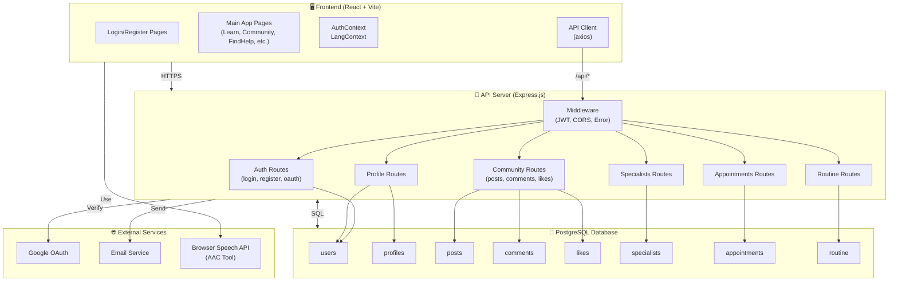

---

## 2. Authentication Flow

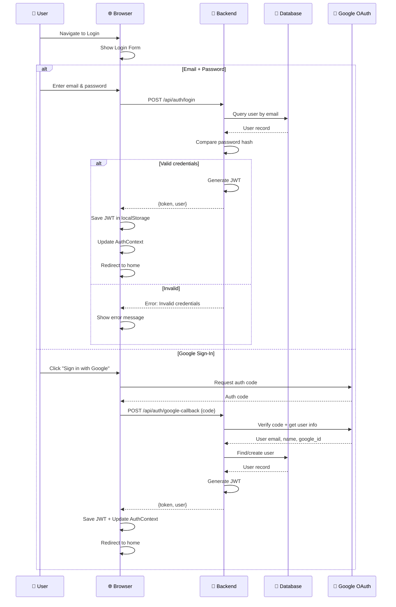

---

## 3. Community Forum - Create Post Flow

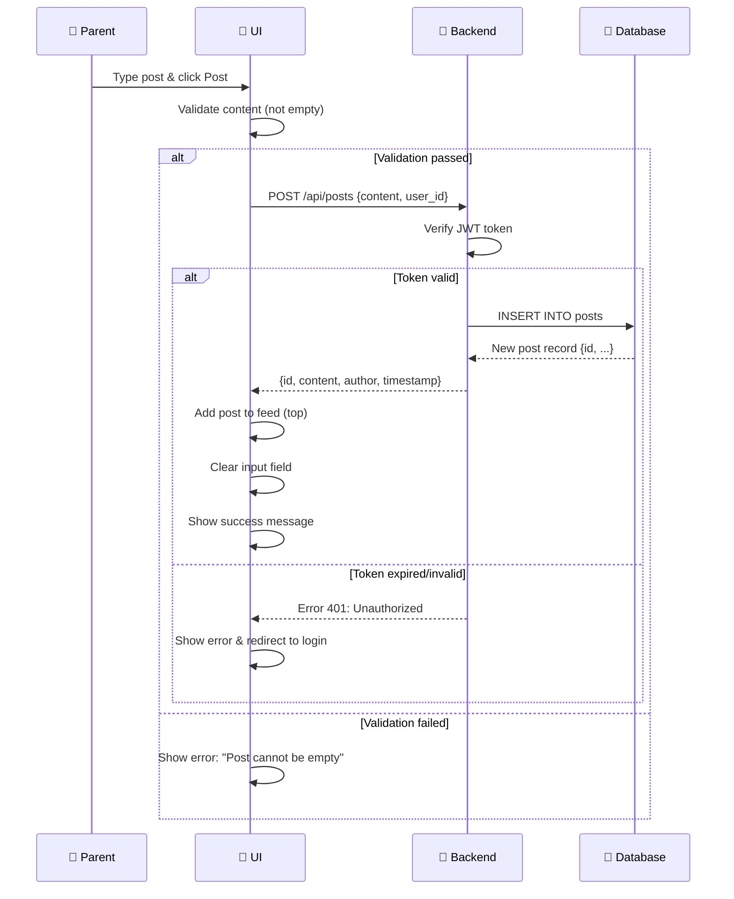

---

## 4. Community Forum - Like Post Flow

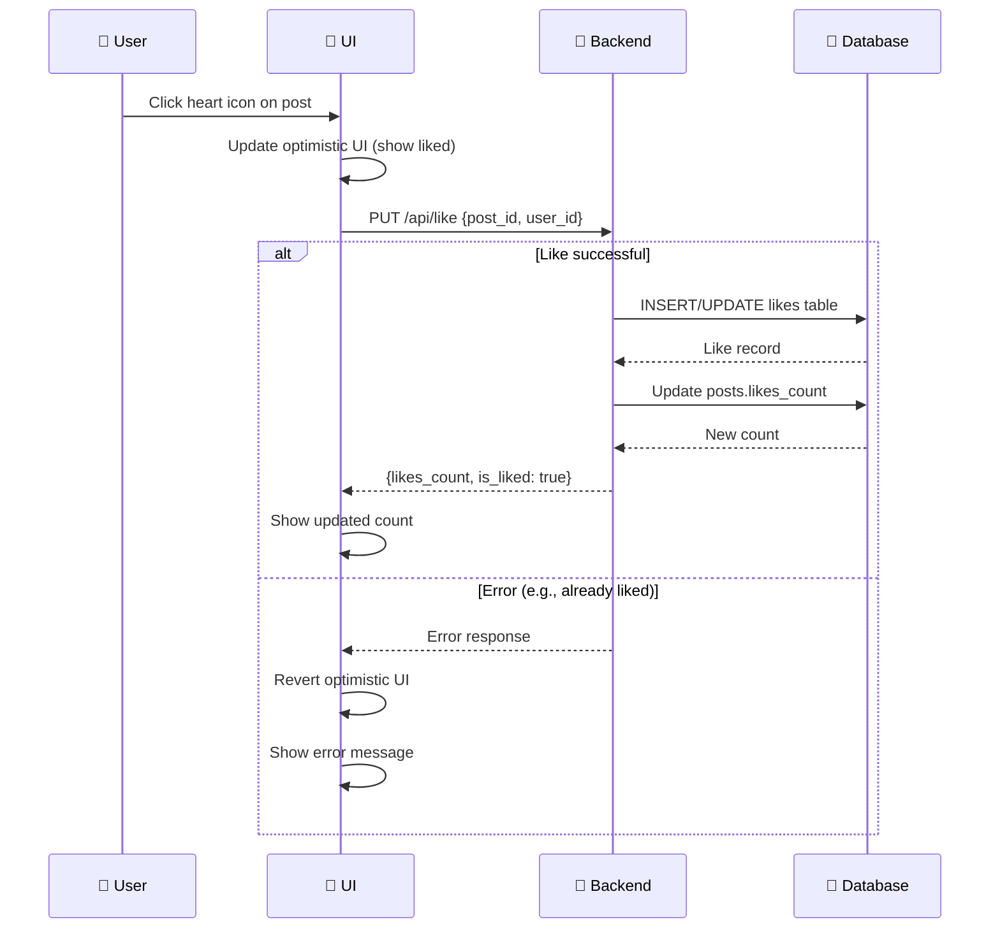

---

## 5. Appointment Booking Flow

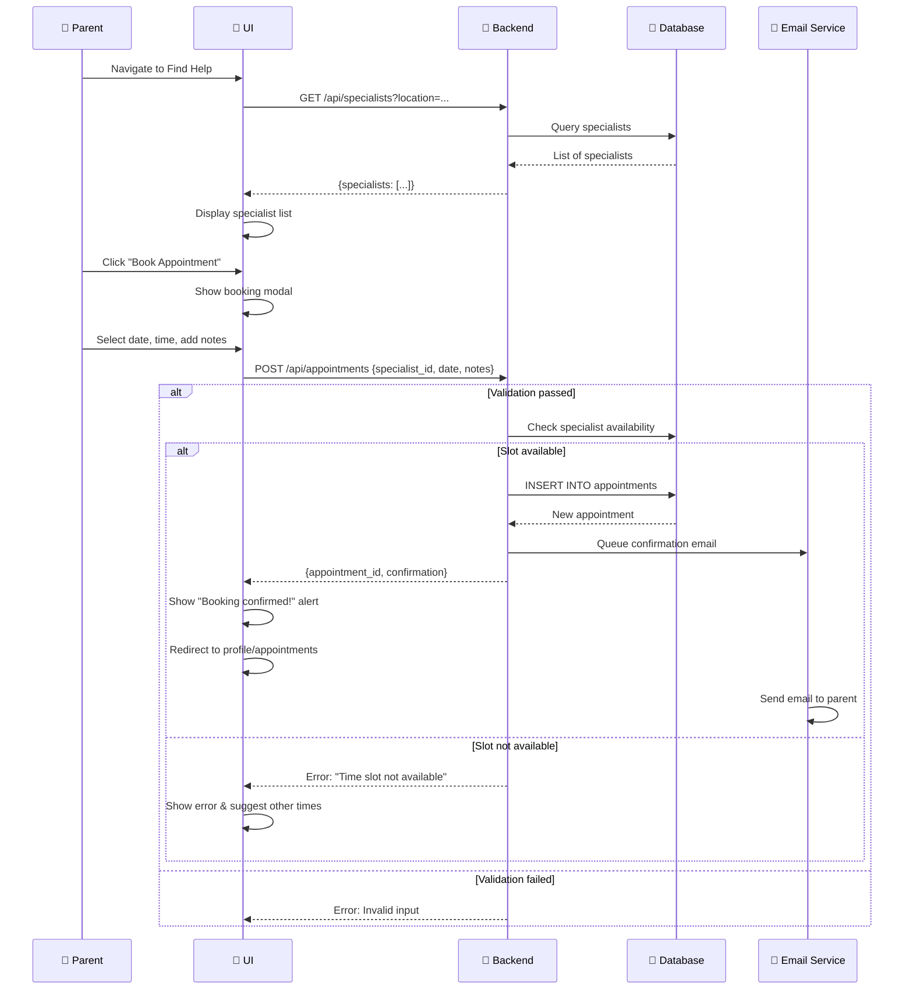

---

## 6. Daily Routine Tracker Flow

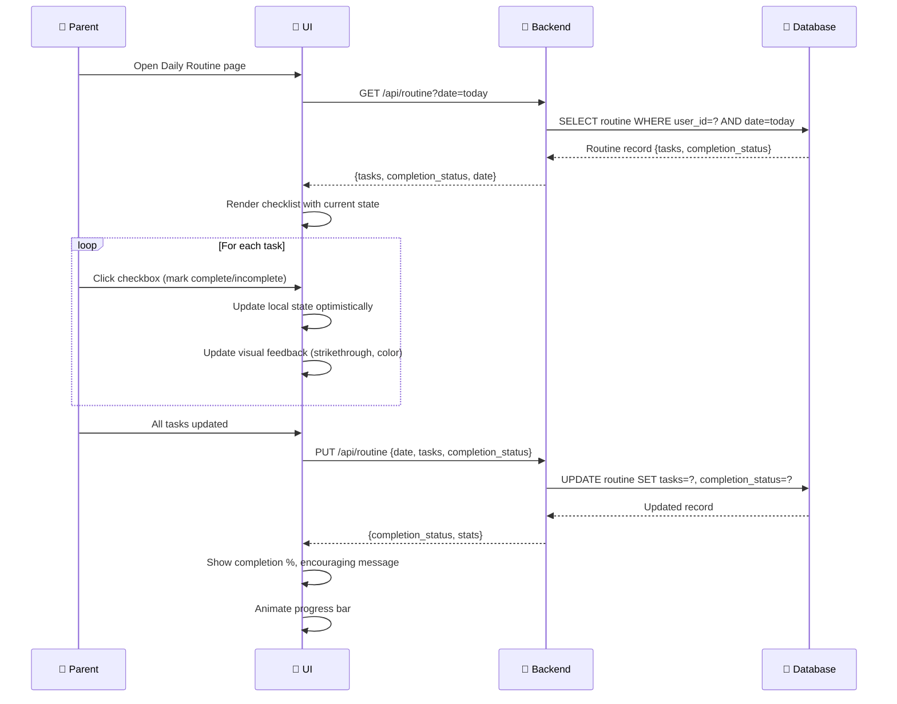

---

## 7. User Authentication & Context Setup

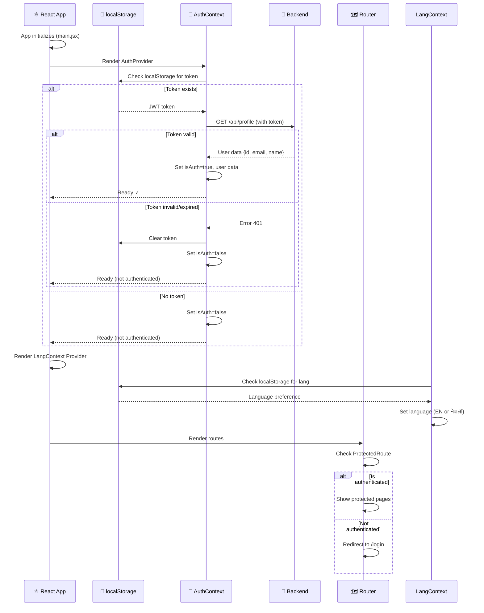

---

## 8. Database Schema Diagram

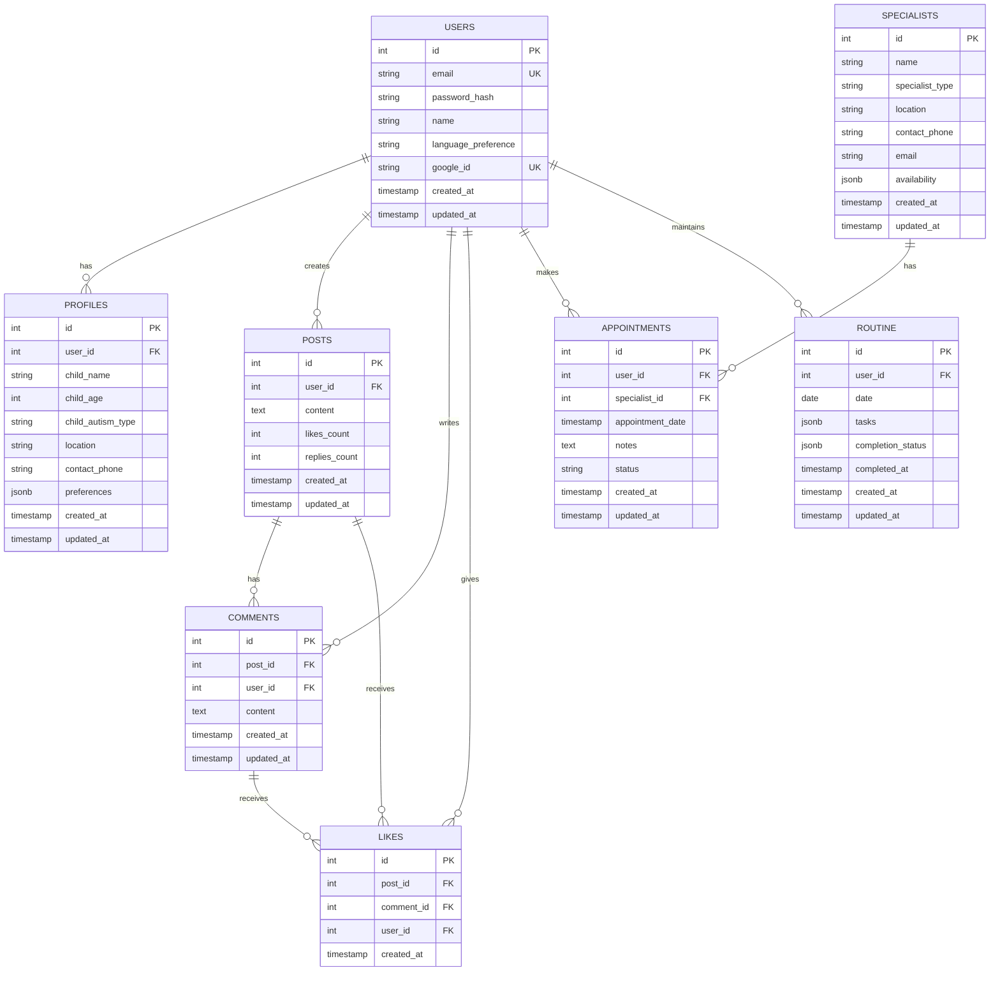

---

## 9. State Management Flow

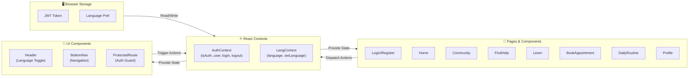

---

## 10. Deployment Architecture

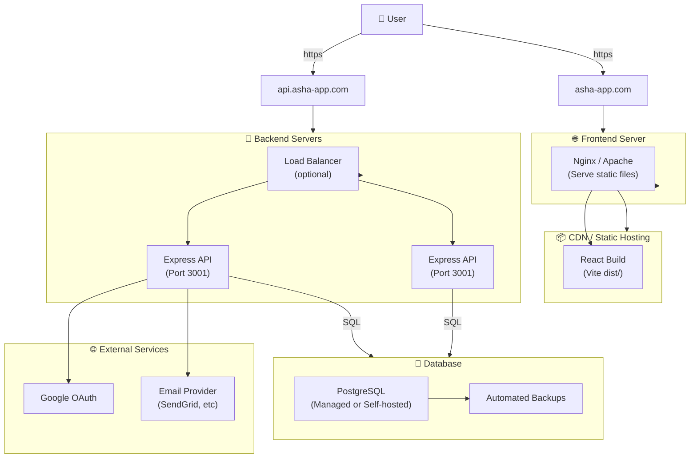

---

## 11. Component Hierarchy

```mermaid
graph TD
    App["App.jsx<br/>(Main entry)"]
    
    subgraph Providers["Providers"]
        AuthProv["AuthProvider"]
        LangProv["LangProvider"]
        Router["BrowserRouter"]
    end

    subgraph Layout["Layout Components"]
        Header["Header"]
        BottomNav["BottomNav"]
        Layout["Layout"]
    end

    subgraph Pages["Page Components"]
        Login["Login"]
        Register["Register"]
        Home["Home"]
        Learn["Learn"]
        Community["Community"]
        FindHelp["FindHelp"]
        BookApp["BookAppointment"]
        DailyRoutine["DailyRoutine"]
        AACTool["AACTool"]
        Profile["Profile"]
        DisabilityChecklist["DisabilityChecklist"]
    end

    subgraph SharedComponents["Shared Components"]
        ProtRoute["ProtectedRoute"]
        LearningModal["LearningModal"]
        Button["Button"]
        Card["Card"]
    end

    App --> Providers
    Providers --> AuthProv
    Providers --> LangProv
    Providers --> Router
    
    AuthProv --> Layout
    LangProv --> Layout
    Router --> Layout
    
    Layout --> Header
    Layout --> Pages
    Layout --> BottomNav
    
    Pages --> SharedComponents
    Header --> SharedComponents
```

---

## 12. Key Data Flows

### Registration & Profile Setup
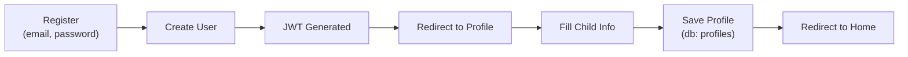

### Forum Interaction
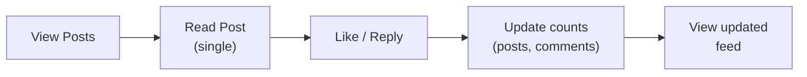

### Specialist Discovery to Booking
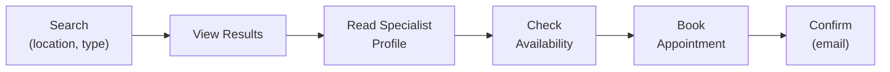

---

## 13. Error Handling Flow

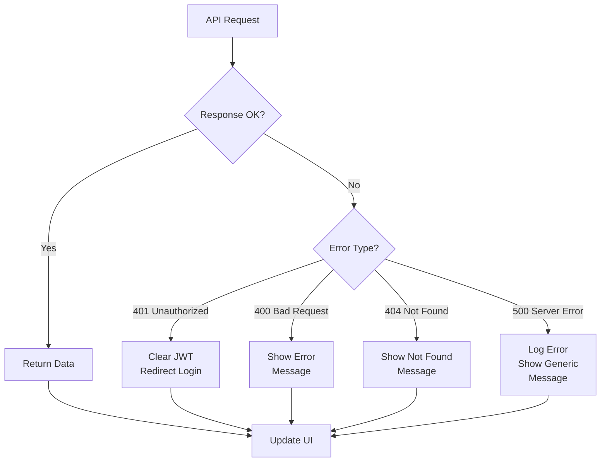

---

## Usage Notes

- **GitHub**: These diagrams render automatically in `.md` files
- **VS Code**: Install "Markdown Preview Mermaid Support" extension
- **GitLab**: Mermaid is built-in
- **Obsidian**: Install Mermaid plugin
- **PlantUML / Draw.io**: Can import/export Mermaid syntax

